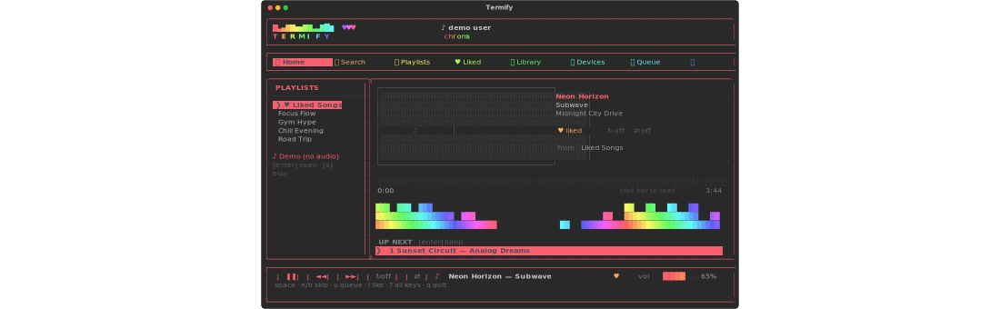
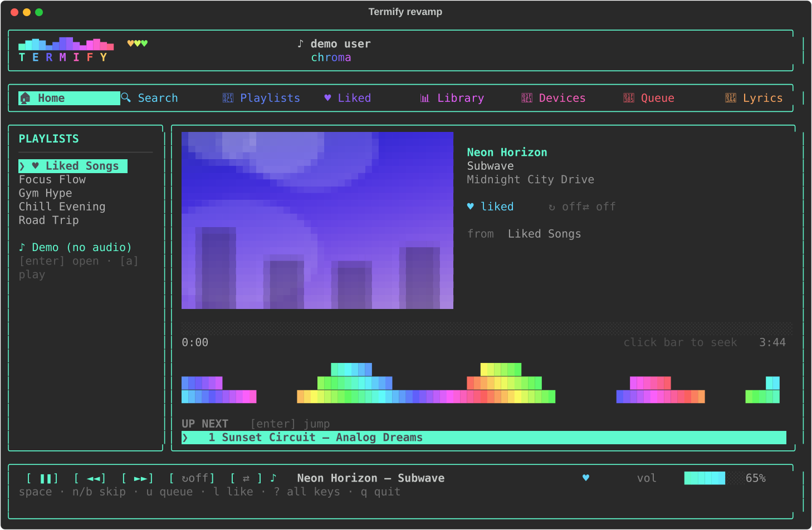
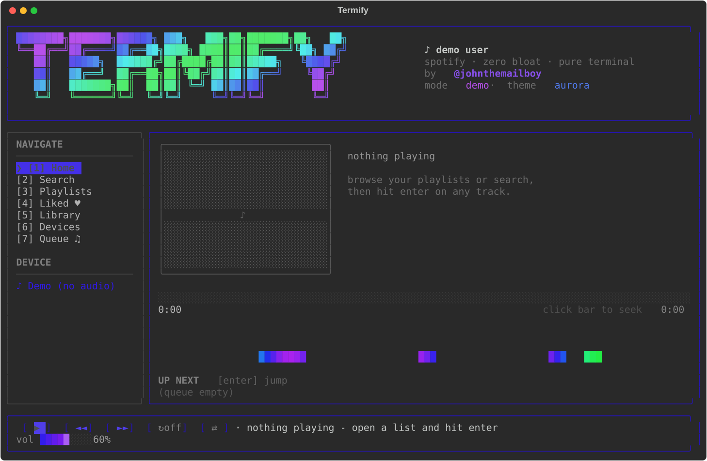
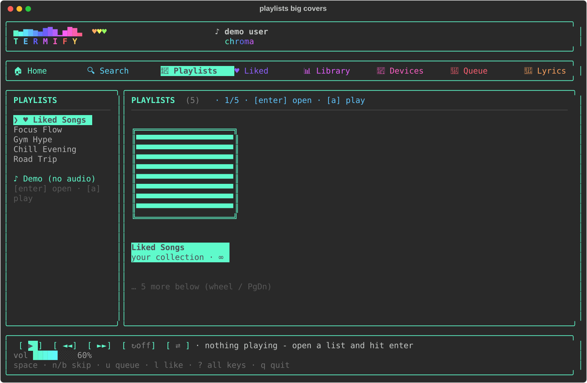

<p align="center">
  
</p>

<h1 align="center">🎧 Termify</h1>

<p align="center">
  <b>A slick terminal-based Spotify client</b> — plays your music right in the
  command line so you can ditch the heavy desktop app.
  <br><br>
  
  
  
</p>

<p align="center">
  <i>made with ♥ by <b>@johnthemailboy</b></i>
</p>

---

## ✨ Why Termify?

The Spotify desktop app hogs your RAM and CPU. Termify gives you the same
**full listening experience in a terminal** — animated gradients, ASCII art,
album covers rendered in the terminal, and real playback. It's fast, light, and
fun to look at.

- 🎵 **Real embedded playback** — streams, decodes and plays tracks itself via
  `librespot` + `PyAV`. No Spotify desktop app needed.
- 🎮 **Full controls** — play/pause, skip, seek, volume, shuffle, repeat, queue.
- 📚 **Your whole library** — playlists (every song, no 500-song cut-off),
  Liked Songs, search, albums, artists, recently played.
- 🎤 **Karaoke lyrics** — a dedicated lyrics view (press `L` or `[8]`) with
  synced lines from LRCLib and a Genius fallback.
- 🔘 **Keyboard media buttons** — your keyboard's play/pause / next / prev keys
  control Termify **even when the terminal isn't focused**. On Windows this uses
  a native low-level hook (no admin, no extra package).
- 📊 **Listening stats** — press `S` for a stats panel with your *"week in
  music"* report (minutes, top tracks/artists, day streak) — stored privately
  on your machine.
- 🧹 **Duplicate finder** — press `F` in a playlist to fold it down to just the
  duplicate songs.
- ➡️ **Play next / play later** — press `N` to queue a track right after the
  current one, or `E` to park it at the end of the queue.
- 🎨 **Gorgeous ASCII UI** — gradient splash banner, album art as truecolor
  half-block art, an animated visualizer, and 6 switchable themes.
- 🖱️ **Mouse support** — click zones, double-click to play, wheel scroll,
  right-click to add a song to a playlist.
- 📅 **Date added** — see exactly when each song landed in a playlist, and sort
  by it with `o`.

---

## 📸 Screenshots

| Revamp layout | Classic layout | Playlists |
|---------------|----------------|-----------|
|  |  |  |

---

## ⚠️ Requirements

Good news: **no packages to install by hand** — the installer does that
automatically. What you need depends on how you launch:

| How you run it | Needs Python? | Manual packages? |
|----------------|---------------|------------------|
| `build.bat` → `Termify.exe` | ✅ Python 3.10+ (on the building PC only) | ❌ none — auto |
| `run.bat` (from source) | ✅ Python 3.10+ | ❌ none — auto |
| the finished `Termify.exe` | ❌ no Python at all | ❌ none |

- **Spotify Premium.** Spotify enforces this server-side for *any* third-party
  playback. Termify is an unofficial, personal-use client.
- **macOS / Linux:** one audio package for sound (one-time, package-manager):
  - Debian/Ubuntu: `sudo apt install libportaudio2`
  - macOS: `brew install portaudio`

---

## 🚀 Quick start

**The easy way — the installer does everything:**
- **Windows:** double-click **`run.bat`** (or `install.py`). It automatically
  finds/gets Python, sets up a private environment, and installs every library
  with built-in retries — nothing to install by hand, then it opens the app.
- **macOS / Linux:** run `python3 install.py`, then `./run.sh`.

> The installer handles Python too (on Windows it can download a portable one),
> creates a private env inside this folder, and prefers prebuilt binaries so
> packages don't try to compile. Delete the folder to uninstall.

**Make a standalone app (`Termify.exe`):** double-click **`build.bat`** — it
builds a ready-to-run `dist\Termify.exe` you can copy anywhere and pin to the
taskbar (no Python needed on the machine that runs it).

**One command (macOS / Linux / WSL):**
```bash
pipx install git+https://github.com/Gravity3432/termify.git
termify            # a `termify` command is now on your PATH
```

**macOS / Linux (no pipx):**
```bash
./run.sh           # sets up on first run, then opens the app
```

**Manual**
```bash
python3 -m venv .venv
source .venv/bin/activate        # Windows: .venv\Scripts\activate
pip install -r requirements.txt
python -m termify --demo         # offline demo — no login needed
python -m termify                # the real thing
```

---

## 🎬 First real run (one-time setup)

1. Create a free app at `https://developer.spotify.com/dashboard` with the
   redirect URI: `http://127.0.0.1:4615/callback`
2. Paste your **Client ID** into Termify when asked.
3. Your browser opens twice: once for library access, once for the audio player.
4. Music plays from your terminal. 🎉

If the first song doesn't start, Termify explains why in plain English at the
bottom of the screen.

---

## 🎮 Controls

| Key | Action |
|-----|--------|
| `space` | Play / pause |
| `n` / `b` | Next / previous |
| `←` / `→` | Seek −5s / +5s |
| `+` / `-` | Volume up / down |
| `s` | Shuffle |
| `r` | Repeat (off → context → track) |
| `l` | Like / unlike current song |
| `/` | Search |
| `o` | Sort list (default → oldest added → newest added → title → artist → album → duration) |
| `S` | Listening stats + "your week in music" report |
| `N` / `E` | Queue selected track to play next / at the end |
| `F` | Find duplicate songs in the current playlist / liked |
| `L` / `8` | Open the lyrics view |
| `[` | Sidebar playlist drawer (browse/play playlists while staying on Home) |
| `1`–`8` | Jump to view |
| 🎵 media keys | play/pause, next, prev on your keyboard (global, optional) |
| `u` | Queue |
| `t` | Cycle theme (15 total, incl. rainbow chroma / neon / synthwave / plasma…) |
| `]` | Toggle layout: **revamp** (tab bar + playlist sidebar) ↔ **classic** (original) |
| `M` | Diagnostics (mouse + last key) |
| `?` | Help overlay |
| `q` | Quit |

**Mouse:** click to select, double-click to play, wheel to scroll, drag the
progress/volume bars, right-click a track to add it to a playlist.

---

## 🗂 Project layout

```
termify/
├── termify/          # the app package (.py files)
├── requirements.txt  # Python dependencies
├── build.bat         # ONE CLICK -> makes a ready-to-run Termify.exe
├── run.bat           # Windows launcher (from source)
├── run.sh            # macOS/Linux launcher
├── termify.spec      # config for building the .exe
├── entry.py          # exe entry point
├── pyproject.toml    # for the pipx install option
├── docs/             # screenshots + animated GIF
└── termify.zip       # release zip of the app package
```

---

## 🛠 Troubleshooting

- **"a Premium account is required"** — playback is Premium-only (Spotify's rule).
- **Song won't start** — Termify auto-heals, re-downloads, and auto-skips a
  track that truly refuses.
- **Mouse clicks not working** — use **Windows Terminal** (not old `cmd`) and
  press `M` to check if the terminal is sending mouse events.
- **"No active device"** — not needed in embedded mode; in remote mode, open
  Spotify on your phone or web player once.

---

## 📜 Disclaimer

Termify is an **unofficial**, personal-use client and is not affiliated with or
endorsed by Spotify. It only streams to your own Premium account. Use responsibly.
